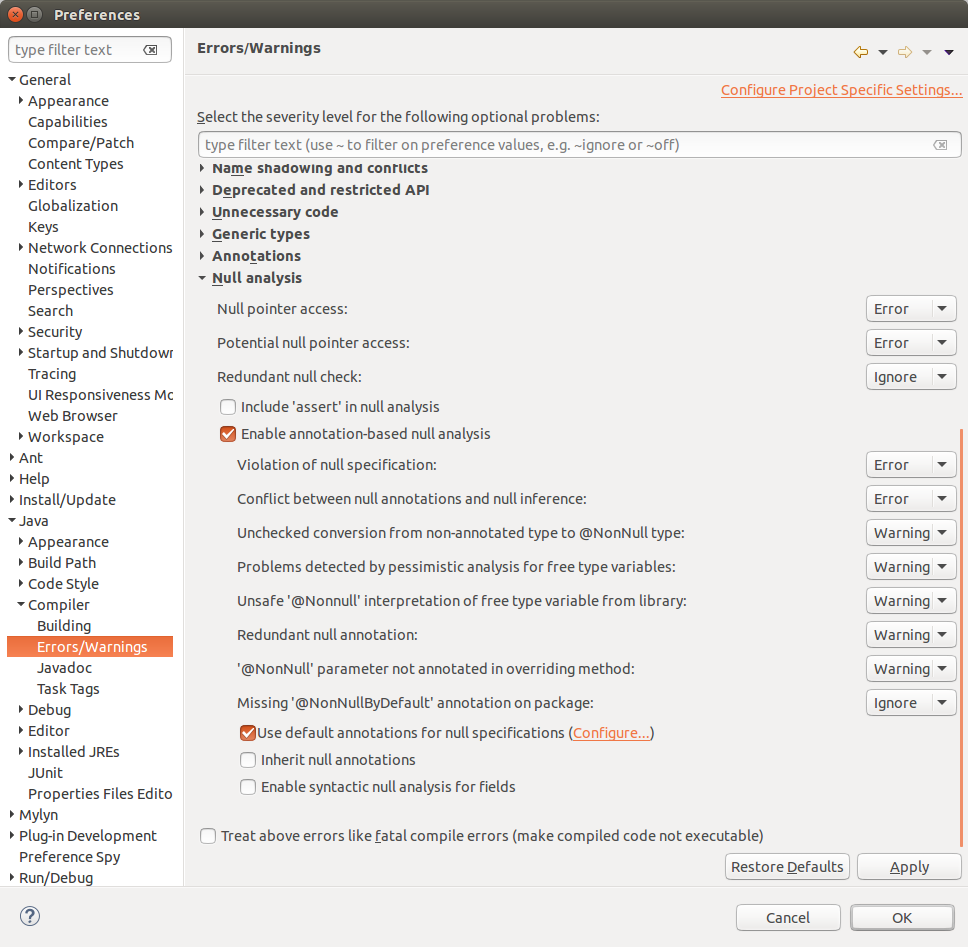

[[nullable_annotations]]
== Defining the API contract via null annotations

=== Eclipse IDE and null annotations

Annotations can be used to provide additional meta information about your API. 
Eclipse JDT provides the following annotations which can be used:

* `@NonNull`: null is not a legal value
* `@Nullable`: null value is allowed and must be expected

These annotations can be placed on:

* Method parameter
* Method return (syntactically a method annotation is used here)
* Local variables
* Fields

You can also specify the default value via the `@NonNullByDefault` annotation which can be specified for a method, a type or a package (via a file package-info.java).
To specify it for a whole package, create the following `package-info.java` file in your package, for example, `com.vogella.test.nullannatations`.

[source, java]
----
@NonNullByDefault  
package com.vogella.test.nullannatations;  
import org.eclipse.jdt.annotation.NonNullByDefault;
----

[[customannotations_definition]]
=== Adding support for null annotations

==== Maven

[source, xml]
----
<dependency>
    <groupId>org.eclipse.jdt</groupId>
    <artifactId>org.eclipse.jdt.annotation</artifactId>
    <version>2.0.0</version>
</dependency>
----

==== Gradle

[source, xml]
----
compile 'org.eclipse.jdt:org.eclipse.jdt.annotation:2.0.0'
----
==== OSGi

Add an optional dependency to `org.eclipse.jdt.annotation` in your MANIFEST.MF

==== Managing the classpath manually

Eclipse provides a quickfix for adding the required dependency. Simple use `@NonNull` in your code and use Ctrl+1 to add the required dependency.

=== Activating annotation based null pointer access analysis

Select menu:Windows[Java > Compiler > Errors/Warnings] and select _Enable annotation-based null analysis_.

